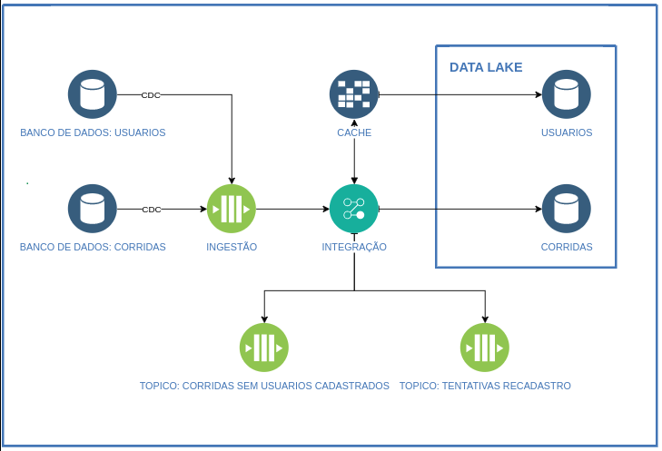

# System Design

Sabendo que hoje temos serviços de aplicativos que conectam motoristas e pessoas que precisam de carona, possibilitando a criação de uma alternativa ao táxi. Imagine que temos as seguintes fontes de dados:

- **Usuários:** Contempla clientes e motoristas identificados por uma coluna tipo.
- **Corridas:** Referência cliente e motorista, também contém informações sobre a viagem realizada.**CorridasCorridas**

Crie um desenho de solução que utiliza CDC para coletar informações de ambas as fontes e une os dados e armazena em um data lake.

Atente-se que não podemos ter corridas sem usuários cadastrados, então não pode haver assincronia entre os dados.

**Bônus:** Deixe explícito quais tecnologias você utilizaria para implementar o desenho de solução.

---

## Resolução

 

## CDC e Ingestão dos Dados
O CDC para banco de dados relacionais poderá ler os logs do SGBD, então a partir disso se entrar um novo registro poderá ser capturado e enviado para um serviço de INGESTÃO. Isso poderá ser feito em real time ou near real time.

### Tecnologias 
- Poderá ser Utilizado CDC (Change Data Capture) para coletar as informações de ambas as fontes de dados (Usuários e Corridas). Em seguida este dados ficaram em tópicos ou filas. Isso pode ser feito utilizando ferramentas como Debezium e Apache Kafka.

## Integração
- Se entrar uma nova **corrida**: CDC envia para o serviço de INGESTÃO, em seguida o serviço de INTEGRAÇÃO vai verificar no serviço de CACHE para ver se este usuário já tem cadastro, 
  - caso positivo, insere o dado no Data Lake (DL),
  - senão, o dado sobre a corrida não é armazenado no DL. Esta tentativa de integração pode ser importante registrar, então eu sugiro que o serviço de INTEGRAÇÃO enviar para um tópico (CORRIDAS SEM USUARIOS CADASTROS) este dado.
- Se entrar um novo **usuário**: CDC envia para o serviço de INGESTÃO, em seguida o serviço de INTEGRAÇÃO vai verificar no serviço de CACHE para ver se este usuário já tem cadastro, 
  - caso positivo, insere esta tentativa em um tópico(TENTATIVAS RECADASTRO) pois este dado pode ser importante para alguma métrica ou algum outro serviço.
  - caso negativo, a INTEGAÇÃO insere no CACHE. Em seguida o serviço de INTEGRAÇÃO executa uma task que pega o dado no CACHE e salva no DL.

### Tecnologias 
- A primeira opção seria utilizar ferramentas de integração como Apache Nifi ou Apache Airflow onde é possível executar tasks, por exemplo um novo dado entrou em um tópico, usando um operador de sensor é possivel executar a task automaticamente. Porpanto com este tipo de ferramenta será possível garantir que os dados sejam adequadamente combinados e correlacionados, pois não pode haver corridas sem usuários registrados.
- A segunda forma de fazer a INTEGRAÇÃO seria utilizar um banco de dados relacional para armazenar as informações e garantir a integridade dos dados (por exemplo, usuários e corridas precisam estar vinculados). Isso pode ser feito utilizando bancos de dados como Postgres, MySQL.

## Cache
- O serviço de CACHE agilizará a validação dos dados pois o serviço de INTEGRAÇÃO somente irá verificar se o usuário tem cadastro através do CACHE. 
- A adição de novos usuários no DL também será feita a partir do CACHE. 
- O CACHE poderá ser feito refresh dos dados de usuários no DL.

### Tecnologias 
Para isso poderá ser utilizado Redis ou Memcache.

## Data Lake (DL)
O DL poderá utilizar um armazenamento dos dados em blob.

### Tecnologias 
Para armazenamento dos dados poderá ser utilizado HDFS sendo os dados salvos em avro, parquet ou orc. Além disso, este dados poderam ser armazenados de forma compactada utilizado zip, gzip (mais comum) ou snappy (mais rápido). 

## Demais Tecnologias
Para este ambiente será necessário ter tecnologias para os seguintes pontos:
- Observabilidade (monitoramento, alertas, logs): DataDog, New Relic, Grafana
- Versionamento de código: Git, Github, Gitlab
- Automação de Infra e config: Terraform, Ansible, Chef
- CI/CD: Github Action, TravisCI

## Extra: Updates e Deletes
Não foi explicitamente cobrado na questão mas pensando em confirmidade com a LGPD será necessário que este ambiente faça Updates e Deletes.
Para isso, faria com que o CDC enviasse para um tópico do serviço de INGESTÃO a requisição para update/delete. Em seguida a INTEGRAÇÃO iria detectar que há esta requisição e executará a task que faz o update/delete no DL.

---
